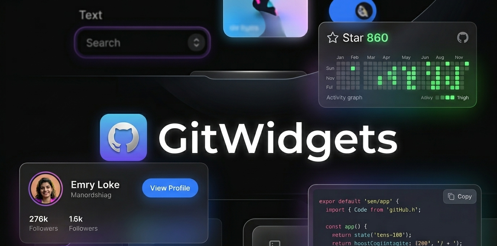

<p align="center">
[✨] Beautiful, dynamic widgets for GitHub Readme pages. (Statistics, Skills, etc.)
</p>
<br/><br/>

## Widgets

### Skills

A clear way to give an overview of programming languages, tools, and software that you're familiar with.

#### Languages


Default             |  &includeNames=true
:-------------------------:|:-------------------------:
[](https://github.com/LeGi0N09/GitWidgets)  |  [](https://github.com/LeGi0N09/GitWidgets)

```md
[](https://github.com/LeGi0N09/GitWidgets)
```

#### Frameworks

Default             |  &includeNames=true
:-------------------------:|:-------------------------:
[](https://github.com/LeGi0N09/GitWidgets)  |  [](https://github.com/LeGi0N09/GitWidgets)

```md
[](https://github.com/LeGi0N09/GitWidgets)
```

#### Libraries

Default             |  &includeNames=true
:-------------------------:|:-------------------------:
[](https://github.com/LeGi0N09/GitWidgets)  |  [](https://github.com/LeGi0N09/GitWidgets)

```md
[](https://github.com/LeGi0N09/GitWidgets)
```

#### Tools

Default             |  &includeNames=true
:-------------------------:|:-------------------------:
[](https://github.com/LeGi0N09/GitWidgets)  |  [](https://github.com/LeGi0N09/GitWidgets)

```md
[](https://github.com/LeGi0N09/GitWidgets)
```


#### Software & IDE's

Default             |  &includeNames=true
:-------------------------:|:-------------------------:
[](https://github.com/LeGi0N09/GitWidgets)  |  [](https://github.com/LeGi0N09/GitWidgets)

```md
[](https://github.com/LeGi0N09/GitWidgets)
```

<br/><br/>
### Profile

Show off your profile with some interesting statistics. Perfect for profile READMEs.


`&data=followers,repositories,stars,commits`
[](https://github.com/LeGi0N09/GitWidgets)

```md
[](https://github.com/LeGi0N09/GitWidgets)
```
<br/><br/>
### Profile Banner

A wide banner card showing your avatar, display name, GitHub handle, bio, and key stats. Perfect for the top of a profile README.

`&username=LeGi0N09`
[](https://github.com/LeGi0N09/GitWidgets)

```md
[](https://github.com/LeGi0N09/GitWidgets)
```

With theme and custom width:
```md
[](https://github.com/LeGi0N09/GitWidgets)
```

<br/><br/>
### Profile Tag

A compact badge showing your avatar, display name, and GitHub handle. Great for inline use in READMEs.

`&username=LeGi0N09`
[](https://github.com/LeGi0N09/GitWidgets)

```md
[](https://github.com/LeGi0N09/GitWidgets)
```

With theme:
```md
[](https://github.com/LeGi0N09/GitWidgets)
```

<br/><br/>
### Skill Tag

A compact badge for a single skill. Great for inline use in READMEs.

`&skill=react`
[](https://github.com/LeGi0N09/GitWidgets)

```md
[](https://github.com/LeGi0N09/GitWidgets)
```

With theme:
```md
[](https://github.com/LeGi0N09/GitWidgets)
```

Supports all the same skill names as the Skills widget (`languages`, `frameworks`, `libraries`, `tools`, `software`).

<br/><br/>
### Commit Streak

Show off your commit streak with current streak, longest streak, and total contributions.

`&username=LeGi0N09`
[](https://github.com/LeGi0N09/GitWidgets)

```md
[](https://github.com/LeGi0N09/GitWidgets)
```

With theme:
```md
[](https://github.com/LeGi0N09/GitWidgets)
```

<br/><br/>
### Themes

GitWidgets supports a great variety of different themes for all widgets, like the ones below.
You can check out more examples in [themes.md](https://github.com/LeGi0N09/GitWidgets/blob/master/THEMES.md), or have a look at all themes in the [themes.ts](https://github.com/LeGi0N09/GitWidgets/blob/master/src/data/themes.ts) file. Feel free to create your own theme(s) and add them to that `themes.ts` file.


`&theme=darkmode`

darkmode             |  default
:-------------------------:|:-------------------------:
[](https://github.com/LeGi0N09/GitWidgets) |  [](https://github.com/LeGi0N09/GitWidgets)<br/>


viridescent             |  carbon
:-------------------------:|:-------------------------:
[](https://github.com/LeGi0N09/GitWidgets) |  [](https://github.com/LeGi0N09/GitWidgets)<br/>


nautilus             |  serika
:-------------------------:|:-------------------------:
[](https://github.com/LeGi0N09/GitWidgets) |  [](https://github.com/LeGi0N09/GitWidgets)

```md
[](https://github.com/LeGi0N09/GitWidgets)
```

<br/><br/>
## TO-DO

* [x] Fix skills text being off-center
* [x] Add themes (dark mode)
* [x] Add Skills: Tools & Frameworks widget
* [x] Add Skills: Software & IDEs widget
* [x] Make autobuilder instead of manual build and push
* [ ] Count organization repositories (+ their stars)
* [x] Truncate name if too long on profile widget
* [x] Make all widgets a modular size
* [x] Add Profile Tag widget
* [x] Add Skill Tag widget
* [x] Add Commit Streak widget
* [ ] Add Twitter widget
* [ ] Add LinkedIn widget
* [ ] Add Instagram widget
* [ ] Add YouTube widget
* [ ] Add Portfolio website widget
* [ ] Add Project link widget
* [x] Add Profile banner widget
* [ ] Add Stats widget
